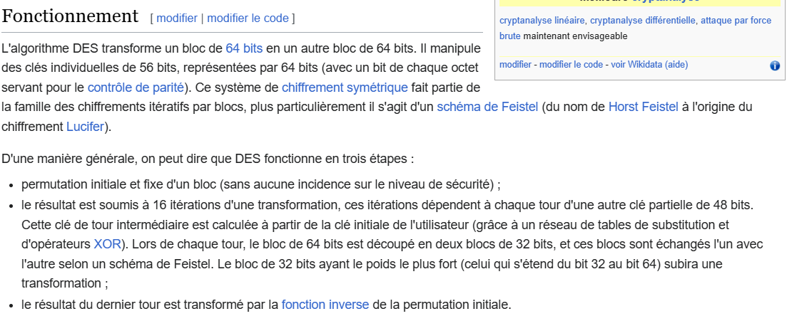
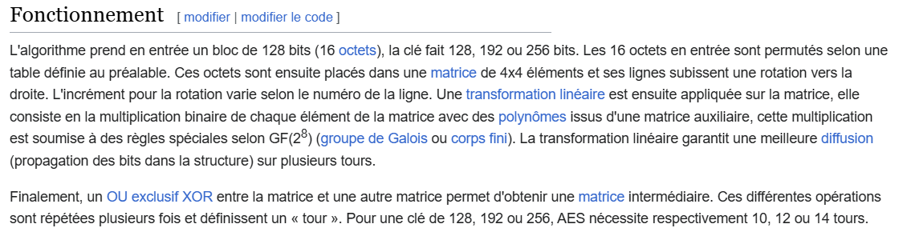

# Les fonctions mathématiques sont-elles des outils de chiffrement efficaces ?

Non, les fonctions mathématiques simples comme les transformations linéaires ou les applications bijectives non linéaires ne sont généralement pas considérées comme des outils de chiffrement efficaces par elles-mêmes. Voici pourquoi:

## Transformations linéaires

Les transformations linéaires comme la multiplication par une matrice inversible ne sont pas sûres pour le chiffrement car si un attaquant obtient suffisamment de paires de textes clairs et chiffrés, il peut retrouver facilement la clé (la matrice) en résolvant un système d'équations linéaires [1](https://www.math.u-bordeaux.fr/~cbachocb/Enseignements/CodesCryptoL1/CC-cours.pdf).

Les algorithmes de chiffrement modernes comme AES, DES, RSA etc. utilisent des constructions mathématiques plus complexes impliquant des opérations non linéaires, des substitutions et des permutations répétées sur les données. Cela les rend beaucoup plus robustes face aux attaques par rapport aux simples fonctions mathématiques [2](https://www.ionos.fr/digitalguide/serveur/securite/apercu-des-diverses-procedures-de-chiffrement/) [5](https://www.kaspersky.fr/resource-center/definitions/encryption).

Citations:
[1](https://www.math.u-bordeaux.fr/~cbachocb/Enseignements/CodesCryptoL1/CC-cours.pdf)
[2](https://www.ionos.fr/digitalguide/serveur/securite/apercu-des-diverses-procedures-de-chiffrement/)
[3](https://fr.wikipedia.org/wiki/Chiffrement_RSA)
[4](https://www.sealpath.com/fr/blog/types-de-chiffrement-guide/)
[5](https://www.kaspersky.fr/resource-center/definitions/encryption)

---

### Introduction

1. **Accroche**
   - Exemple d'un chiffrement célèbre (comme le RSA) ou une anecdote historique sur le chiffrement.
      * RSA : Chiffrement asymétrique inventé en 1977 par Rivest, Shamir et Adleman.
      * Le chiffre de César est l'un des plus anciens systèmes de chiffrement, utilisé par Jules César pour sécuriser ses communications militaires. Il consiste à décaler chaque lettre d'un message par un nombre fixe de places dans l'alphabet. Par exemple, avec un décalage de trois, "A" devient "D". Ce système, bien que simple par rapport aux standards actuels, a joué un rôle important dans l'histoire de la cryptographie et continue d'être étudié aujourd'hui pour son importance historique et éducative.
   - Statistique sur l'importance de la sécurité des données dans le monde numérique actuel.
      * 43 % des cyberattaques ciblent les petites entreprises (source : [Verizon](https://www.verizon.com/business/resources/articles/small-business-cyber-security-and-data-breaches/)).
2. **Présentation de la problématique**
   - Définition du chiffrement et des fonctions mathématiques utilisées.
      * Chiffrement : Processus de conversion de données en un format illisible avec la clé de déchiffrement correspondante.
      * Les fonctions utilisés sont les fonctions usuelles (logarithme, exponentielle, pôlynome de degré n).
   - Importance de la question dans le contexte actuel de la cybersécurité.
      * Les attaques informatiques sont de plus en plus sophistiquées et nécessitent des systèmes de chiffrement robustes pour protéger les données sensibles.
3. **Annonce du plan**
   - Présentation des grandes parties du plan.

### I. Comprendre les Fonctions Mathématiques dans le Chiffrement

1. **Définition et Types de Fonctions Mathématiques Utilisées**
   - Explication des fonctions mathématiques (fonctions arithmétiques, algébriques, logarithmiques, etc.).
      > Qu'est qu'une fonction ? Une fonction c'est un objet mathématique qui permet de mettre en correspondance quelque chose et qui lui associe autre chose. Par exemple, une fonction peut prendre un nombre en entrée et lui associer un autre nombre en sortie. (Ca peut-être pas mal de pas le sortir et de potentiellement avoir une question là-dessus). 
   - Introduction aux concepts de cryptographie : chiffrement symétrique et asymétrique.
2. **Exemples de Fonctions Utilisées en Cryptographie**
   - Algorithmes de chiffrement symétrique : AES, DES.
     * DES : Data Encryption Standard, l'un des premiers algorithmes de chiffrement symétrique, remplacé par AES en raison de sa vulnérabilité aux attaques par force brute.
      

      * AES : Advanced Encryption Standard, utilisé pour le chiffrement de données sensibles. Utilisé par le gouvernement américain pour protéger les informations classifiées.
      

   > Ces deux algorithmes sont des algorithmes de chiffrages par bloc de taille fixe. Ils utilisent des substitutions et des permutations pour chiffrer les données.
   - Algorithmes de chiffrement asymétrique : RSA.
      * ### Chiffrement RSA

      **RSA** est un algorithme de cryptographie asymétrique utilisant deux clés :
      - **Clé publique** : pour chiffrer les messages.
      - **Clé privée** : pour déchiffrer les messages.

      **Fonctionnement** :
     1. **Clés** :
      - Deux nombres premiers $p$ et $q$ sont choisis.
      - Calcul de $n = p \times q$ (partie de la clé publique).
      - Calcul de $e$ (exposant de chiffrement) et de $d$ (exposant de déchiffrement).

     2. **Chiffrement** :
      - Le message $M$ est chiffré avec $(n, e)$ : $(C = M^e \equiv n)$.

     3. **Déchiffrement** :
      - Le message chiffré $C$ est déchiffré avec $(n, d)$ : $( M = C^d \equiv n)$.

      **Sécurité** :
      Repose sur la difficulté de factoriser de grands nombres.

      **Utilisations** :
      - Sécurisation des communications (HTTPS).
      - Signatures numériques.
      - Chiffrement des emails.

      RSA est fiable et essentiel pour sécuriser les données.
3. **Propriétés Mathématiques Importantes pour le Chiffrement**
   - Propriétés nécessaires : non-inversibilité, complexité calculatoire, collisions, etc.
   - Importance de la théorie des nombres et des mathématiques discrètes.

   a. **Non-inversibilité**:
   - Dans le contexte du chiffrement, la non-inversibilité fait référence au fait qu'il doit être difficile, voire impossible, de retrouver le texte en clair à partir du texte chiffré sans posséder la clé de déchiffrement appropriée. En d'autres termes, le processus de chiffrement doit être irréversible sans la clé. Cela garantit que même si un attaquant intercepte le texte chiffré, il ne peut pas le déchiffrer sans la clé correspondante.

   b. **Complexité calculatoire**:
   - La complexité calculatoire se réfère à la difficulté d'effectuer certaines opérations mathématiques associées au chiffrement, telles que la factorisation de grands nombres en cryptographie asymétrique (comme dans le cas du RSA) ou la recherche de collisions dans les fonctions de hachage. Une propriété souhaitée des algorithmes de chiffrement est qu'ils soient difficiles à casser même avec des ressources de calcul importantes, comme celles disponibles pour les supercalculateurs.

   c. **Collisions**:
   - Dans le contexte des fonctions de hachage utilisées en cryptographie, une collision se produit lorsqu'il existe deux entrées différentes qui produisent le même résultat de hachage. Les fonctions de hachage doivent être conçues de manière à minimiser le risque de collisions, car celles-ci pourraient être exploitées pour compromettre la sécurité des systèmes cryptographiques. Par exemple, si deux messages différents produisent le même condensé de hachage, un attaquant pourrait substituer un message par un autre sans être détecté.

   d. **Théorie des nombres et mathématiques discrètes**:
   - La théorie des nombres et les mathématiques discrètes fournissent la base mathématique essentielle pour de nombreux algorithmes de chiffrement. Par exemple, la factorisation des grands nombres premiers est utilisée dans RSA, tandis que les courbes elliptiques, qui sont des structures algébriques, sont utilisées dans la cryptographie à courbes elliptiques. Ces domaines mathématiques fournissent des outils pour concevoir des algorithmes robustes et sécurisés en exploitant des propriétés spécifiques des nombres entiers et des structures discrètes.

### II. Efficacité des Fonctions Mathématiques comme Outils de Chiffrement

1. **Critères d’Efficacité**
   - Sécurité : résistance aux attaques (brute force, analyse cryptographique, etc.).
   - Performance : rapidité et efficacité de l'algorithme.
   - Scalabilité : capacité à gérer de grandes quantités de données.
2. **Analyse de Cas Pratiques**
   - Efficacité du RSA : sécurité basée sur la factorisation des grands nombres.
   - Efficacité de l'AES : rapidité et sécurité basée sur les substitutions et permutations.
3. **Limitations et Vulnérabilités**
   - Problèmes potentiels : attaques quantiques (impact sur RSA), faiblesses dans les implémentations (side-channel attacks).
   - Importance de la mise à jour et de l'évolution des algorithmes face aux nouvelles menaces.

### III. Perspectives Futures et Innovations

1. **Cryptographie Post-Quantique**
   - Défis posés par les ordinateurs quantiques aux algorithmes actuels.
   - Nouveaux algorithmes résistants aux attaques quantiques : Lattice-based cryptography, Hash-based cryptography, etc.
2. **Avancées en Mathématiques et Algorithmes**
   - Innovations mathématiques pour renforcer la sécurité des algorithmes de chiffrement.
   - Recherche continue pour trouver des algorithmes plus efficaces et sécurisés.
3. **Implications Éthiques et Réglementaires**
   - Conséquences de l'évolution des algorithmes de chiffrement sur la vie privée et la sécurité.
   - Importance des régulations pour assurer une utilisation responsable des technologies de chiffrement.

### Conclusion

1. **Synthèse des Points Clés**
   - Récapitulatif des critères d’efficacité des fonctions mathématiques dans le chiffrement.
   - Importance de la sécurité et de l'innovation continue.
2. **Ouverture**
   - Question ouverte sur l'avenir des techniques de chiffrement face aux progrès technologiques.
   - Invitation à réfléchir sur l'équilibre entre sécurité, performance et éthique dans l’utilisation des technologies de chiffrement.
